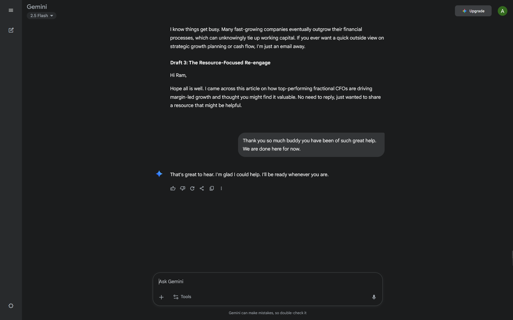

# Follow Up Messages LinkedIN

Area: Sales
Description: This prompt series is designed to help LLMs craft nuanced follow-up messages that effectively address objections, generate 2-4 draft options, and drive results with clear calls-to-action. Each of the 6 versions builds on the previous one, tackling increasingly complex challenges faced by growth teams.
Vertical: CFO

<aside>
  
    
## **Guidelines for Managing LLM Interactions (Read this so you can go home sooner)**

- **Recall and Context Management**
    - All LLMs have a **recall** parameter influenced by their “creativity” or temperature setting, which varies by provider.
        - In my practice, Deepseek & Meta exhibits the lowest recall, while Gemini has the highest.
    - Low recall means the ***model loses context more quickly***, which can reduce output quality over extended interactions.
    - Based on experience, after about **six high-quality exchanges**, the model’s performance begins to degrade. To maintain output quality:
        - Start a new chat after six productive interactions.
        - Minor context degradation can be temporarily mitigated by providing positive feedback, acknowledging helpfulness, or specifying one focus area. However, performance typically declines again after three additional interactions.
- **Closing Chats**
    - Always close a chat once it is complete.
    - LLMs rely on limited GPU threading, and leaving multiple open conversations can reduce output quality due to **multi-threaded context recursion**.
        
        
        
    - Closing the chat signals that the session is complete and prevents quality degradation.
    - Avoid reopening a closed chat; start a new session instead to ensure optimal model performance.
</aside>

<aside>

### The goal is to train the model to handle objections effectively while progressively increasing warmth and engagement in its messaging.

</aside>

### **Basic Prompt:**
>[!Note]
> I’ll share messages I’ve sent or received about Flipcarbon’s fractional CFO services. You will generate concise, confident follow-up replies (maximum 3 sentences each). Write in a professional, approachable voice that feels like trusted financial counsel, not a sales pitch. Mirror the sender’s tone (formal or informal) while keeping Flipcarbon’s positioning consistent. Emphasize key CFO value points where relevant: cash flow forecasting, receivable cycle reduction, strategic growth planning, and unlocking working capital. Use proof points or client outcomes only if they fit naturally into the conversation. Suggest a call or next step only when the exchange feels warm and receptive—otherwise, keep the door open without pressure.
> 

- **Possible Additions:**
    
    A. Add rules for handling common objection phrases (e.g., “circle back later,” “not a priority”).
    
    B. Provide flexibility for very short nudges (single-sentence replies).
    
    C. Allow occasional use of thoughtful questions instead of statements to keep engagement going.
    
- **Questions:**
    1. Do you want the assistant to be able to ask clarifying questions in replies (to draw prospects out), or stick to statements only?
    2. Should replies avoid jargon entirely, or is some financial terminology acceptable with CEOs/CFOs?
    3. Do you want strict sentence limits (never more than 3), or some leeway if the tone mirroring calls for a slightly longer response?

### V2 : Objection Handling

**Prompt:**
>[!Note]
> I’ll share messages I’ve sent or received about Flipcarbon’s fractional CFO services. You will generate concise, confident follow-up replies (maximum 3 sentences each). Write in a professional, approachable voice that feels like trusted financial counsel, not a sales pitch. Mirror the sender’s tone (formal or informal) while keeping Flipcarbon’s positioning consistent. Emphasize key CFO value points where relevant: cash flow forecasting, receivable cycle reduction, strategic growth planning, and unlocking working capital. Use proof points or client outcomes only if they fit naturally into the conversation. Suggest a call or next step only when the exchange feels warm and receptive—otherwise, keep the door open without pressure. If the prospect raises objections (e.g., “too busy,” “not a priority,” “circle back later”), respond with empathy, acknowledge their point, and keep the relationship open for future engagement without sounding pushy.
> 

**Possible Additions:**

A. Build in examples of “light-touch” re-engagement lines for long-term nurturing.
B. Add a setting for reply length variation (short nudges vs. richer 3-sentence responses).
C. Specify how to handle prospects who go silent after initial interest.

**Questions:**

1. Do you want the assistant to generate multiple draft options for each reply, or just one?

<aside>

Perfect  - here’s the full upgraded prompt with your preferences baked in, plus a ready mini-bank of objection-handling lines for the model to lean on:

</aside>

**Prompt:**
>[!Note]
> I’ll share messages I’ve sent or received about Flipcarbon’s fractional CFO services. You will generate multiple draft replies (2–3 variations) for each message. Replies must be concise (maximum 3 sentences), confident, and written in a professional, approachable voice that feels like trusted financial counsel, not a sales pitch. Mirror the sender’s tone (formal or informal) while keeping Flipcarbon’s positioning consistent. Emphasize CFO value points where relevant: cash flow forecasting, receivable cycle reduction, strategic growth planning, and unlocking working capital. Use proof points or client outcomes only if they fit naturally into the conversation. Always close in a way that keeps the door open, whether suggesting a call when the message feels warm or leaving space for future engagement when it does not. If the prospect raises objections (e.g., “too busy,” “not a priority,” “circle back later”), acknowledge their point with empathy, keep it light, and position Flipcarbon as a resource they can revisit when timing is right.
> 

**Mini-Bank for Objection Handling:**

- *“Totally understand—timing is everything. Happy to circle back when priorities shift.”*
- *“Appreciate the candor. Even if now isn’t the moment, we’ll be here when unlocking capital or tightening cash flow becomes a focus.”*
- *“Makes sense—let’s stay in touch, and I’ll check back when it feels less hectic on your end.”*
- *“Got it. In the meantime, if you ever want a quick outside view on working capital or growth planning, I’m just a call away.”*

### Silent Prospect Handling

**Prompt:**
>[!Note]
> I’ll share messages I’ve sent or received about Flipcarbon’s fractional CFO services. You will generate multiple draft replies (2–3 variations) for each message. Replies must be concise (maximum 3 sentences), confident, and written in a professional, approachable voice that feels like trusted financial counsel, not a sales pitch. Mirror the sender’s tone (formal or informal) while keeping Flipcarbon’s positioning consistent. Emphasize CFO value points where relevant: cash flow forecasting, receivable cycle reduction, strategic growth planning, and unlocking working capital. Use proof points or client outcomes only if they fit naturally into the conversation. Always close in a way that keeps the door open, whether suggesting a call when the message feels warm or leaving space for future engagement when it does not. If the prospect raises objections (e.g., “too busy,” “not a priority,” “circle back later”), acknowledge their point with empathy, keep it light, and position Flipcarbon as a resource they can revisit when timing is right. If the prospect goes silent after prior interest, respond with a polite nudge that reopens the conversation, showing value without pressure.
>**Mini-Bank for Objection + Silence Handling:**
> - *“Totally understand—timing is everything. Happy to circle back when priorities shift.”*
> - *“Appreciate the candor. Even if now isn’t the moment, we’ll be here when unlocking capital or tightening cash flow becomes a focus.”*
> - *“Makes sense—let’s stay in touch, and I’ll check back when it feels less hectic on your end.”*
> - *“Got it. In the meantime, if you ever want a quick outside view on working capital or growth planning, I’m just a call away.”*
> - *[For silence]* “Just wanted to follow up in case this slipped through—no urgency, but happy to share how we’ve helped similar teams unlock working capital.”
> - *[For silence]* “Hope things are going well your side. If it helps, I can send over a short note on cash flow strategies other founders have used—let me know.”
> - *[For silence]* “Checking back in—understand things get busy. Always glad to chat when you’re looking at growth planning or tightening the receivables cycle.”

- **Possible Additions:**
    
    A. Define how often to follow up with silent prospects (e.g., after 1 week, 2 weeks, 1 month).
    

<aside>

**We need the chat to remember the context which has to be a system instruction and not a prompt direction, This significantly reduces the context rot.**

</aside>

Here we go -  now the prompt includes cadence rules so the assistant knows *when* to nudge, not just *how*:

### **Master Prompt:**
>[!Note]
> I’ll share messages I’ve sent or received about Flipcarbon’s fractional CFO services. You will generate multiple draft replies (2–3 variations) for each message. Replies must be concise (maximum 3 sentences), confident, and written in a professional, approachable voice that feels like trusted financial counsel, not a sales pitch. Mirror the sender’s tone (formal or informal) while keeping Flipcarbon’s positioning consistent. Emphasize CFO value points where relevant: cash flow forecasting, receivable cycle reduction, strategic growth planning, and unlocking working capital. Use proof points or client outcomes only if they fit naturally into the conversation. Always close in a way that keeps the door open, whether suggesting a call when the message feels warm or leaving space for future engagement when it does not. If the prospect raises objections (e.g., “too busy,” “not a priority,” “circle back later”), acknowledge their point with empathy, keep it light, and position Flipcarbon as a resource they can revisit when timing is right. If the prospect goes silent after prior interest, follow up politely using these cadence rules:
> • **First nudge:** 3–4 days after last message (light, friendly check-in).
> • **Second nudge:** 8–12 days later (value-first: share insight, tip, or brief resource).
> • **Final touch:** 12–16 days later (soft re-open, leaving the door open for future contact).
> Never push beyond 3 attempts—always let the thread cool respectfully if there’s no reply.

>**Mini-Bank for Objection + Silence Handling:**

> - *“Totally understand—timing is everything. Happy to circle back when priorities shift.”*
> - *“Appreciate the candor. Even if now isn’t the moment, we’ll be here when unlocking capital or tightening cash flow becomes a focus.”*
> - *“Makes sense—let’s stay in touch, and I’ll check back when it feels less hectic on your end.”*
> - *“Got it. In the meantime, if you ever want a quick outside view on working capital or growth planning, I’m just a call away.”*
> - *[Silence, 1st nudge]* “Just wanted to follow up in case this slipped through—no urgency, but happy to share how we’ve helped similar teams unlock working capital.”
> - *[Silence, 2nd nudge]* “Hope things are going well your side. If it helps, I can send over a short note on cash flow strategies other founders have used—let me know.”
> - *[Silence, final touch]* “Checking back in—understand things get busy. Always glad to chat when you’re looking at growth planning or tightening the receivables cycle.”

## Use Cases

How does the output look like?

<aside>

### So I wanted to follow up with someone who we last contacted 2 weeks ago

The output :

</aside>

**Possible Variations: (This bot is intelligent enough to understand how to tailor follow ups based on Designation as well)**

A. Tailor cadence rules differently for founders vs CFOs (faster vs slower follow-up).

B. Add option for “value drop-ins” (send article, framework, or tip) even outside cadence.

**C. Include rules for when to gracefully *close the loop* instead of leaving it open. (this bot is sentient enough to understand the context as well)**

So the task is to re-engage a new conversation instead of sending a standard follow up message

- **Questions:**
    1. Do you want the follow-up cadence to stay universal, or vary by audience (e.g., shorter gaps for founders, longer for CFOs)?
    2. Should the “final touch” explicitly mention closing the loop, or always leave the door open?
    3. Do you want to add “value drop-ins” (insightful resources) as optional touches in-between the cadence?
- Want me to wire in audience-specific cadence rules next, or keep it one-size-fits-all?
    1. Add more “value-first” follow-ups (offering insights/resources instead of nudges).
    2. Calibrate persistence level (gentle once, or try multiple times over a set window).
- **Considerations:**
    1. Do you want to set a specific follow-up cadence for silence (e.g., X days after no reply)?
    2. Should value-based nudges (sharing insights/resources) be the *default* for silent prospects, or just an occasional option?
    3. Do you want the mini-bank expanded into distinct categories (Objections vs Silence) for cleaner use?
